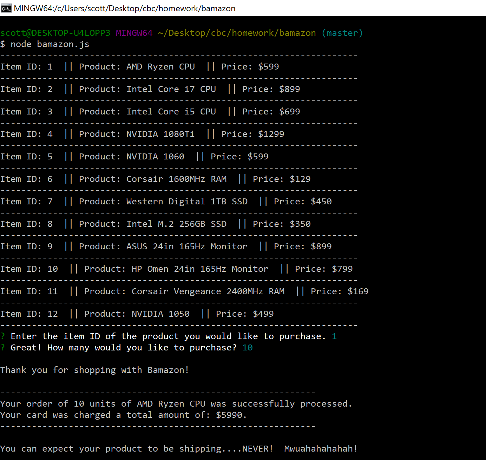
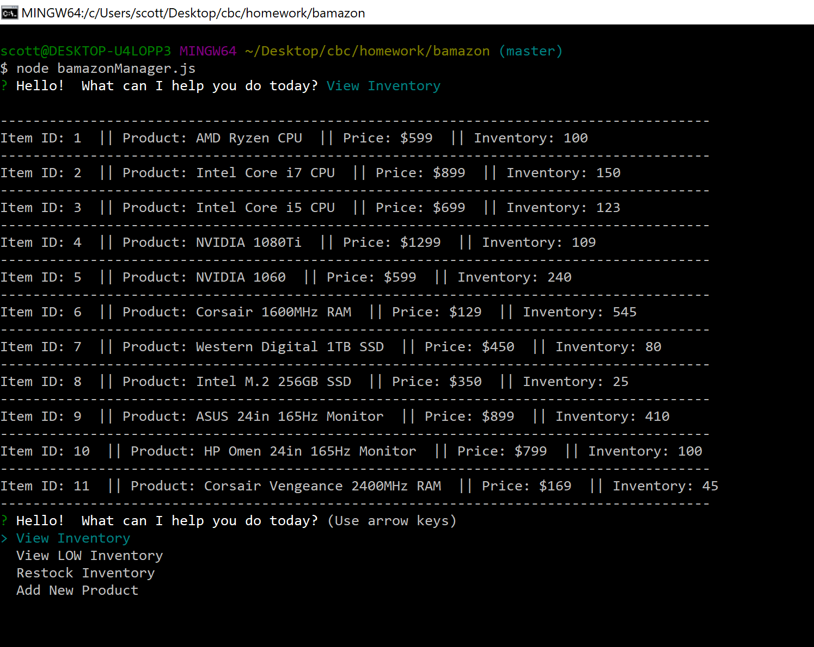
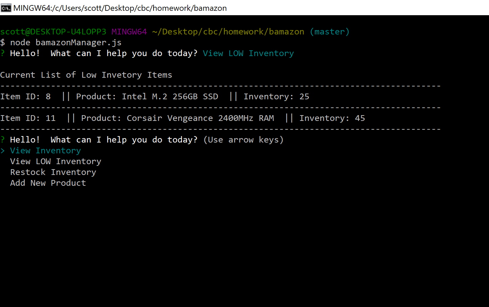
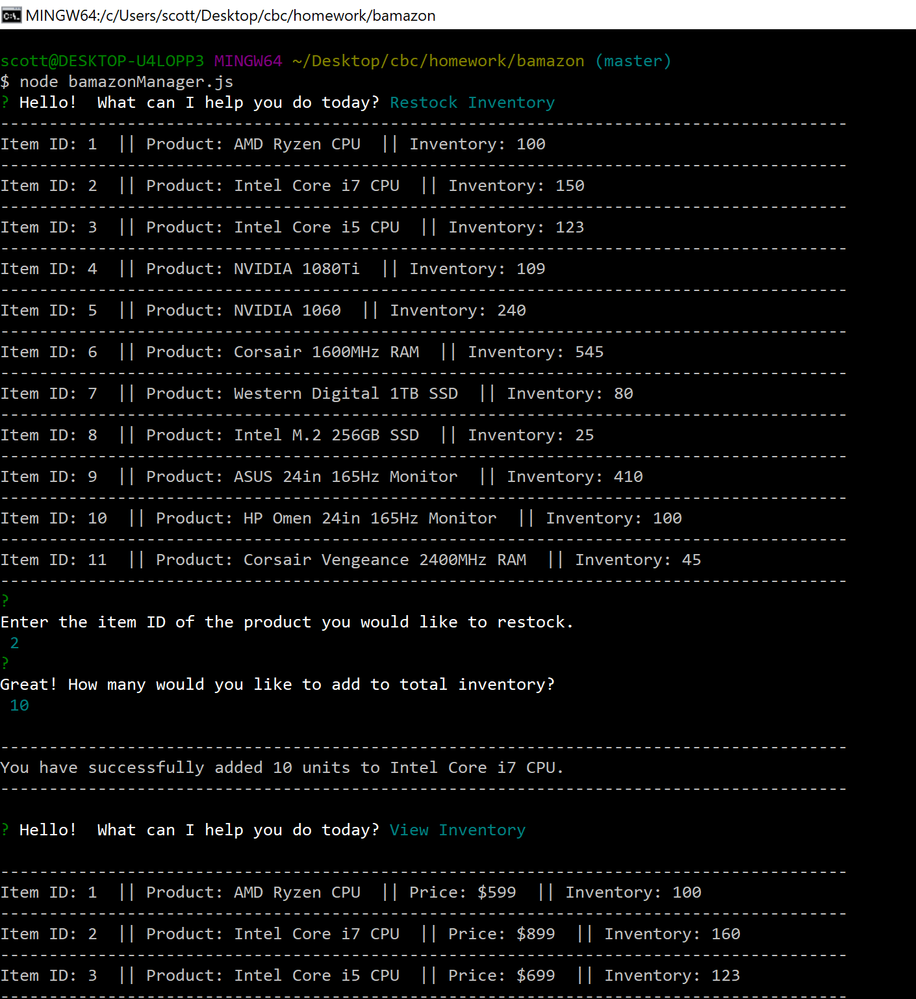
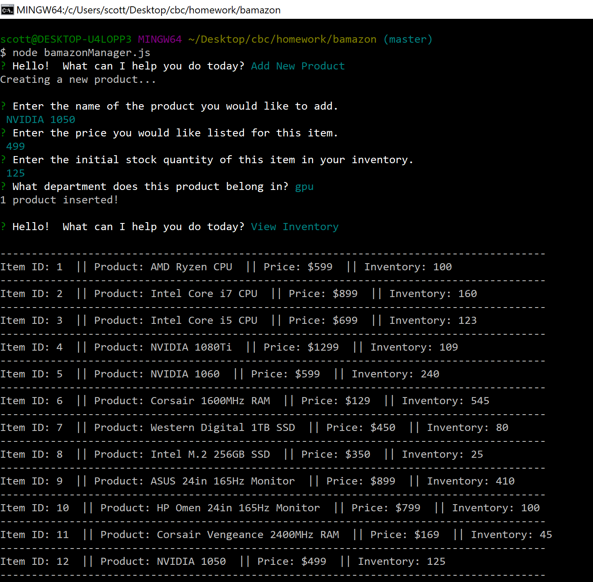

# Bamazon

https://kilcannon.github.io/bamazon/

### Welcome to my super awesome Bamazon Node App!

This app gives you the ability to operate as a shopper or manager at Bamazon.

Technology includes:
+ Javascript
+ NodeJS
+ NPM

Theme: Keepin' it super Node-tastic!

### Current features include:

+ Error handling in the event of incorrect data or responses from APIs
+ Ability to view products for sale, purchase products, add new products, and restock inventory (depending on whether shopper or manager)
+ Interacts with a persistent MySQL database

### Features to come:
+ Add Supervisor view to look at metrics from sales on a different layer

### Image Captures of App Functioning
Customer View 

Manager Invetory View 

Manager LOW Invetory View 

Manager Restock Product View 

Manager Add Product View 

### Feedback is always appreciated!